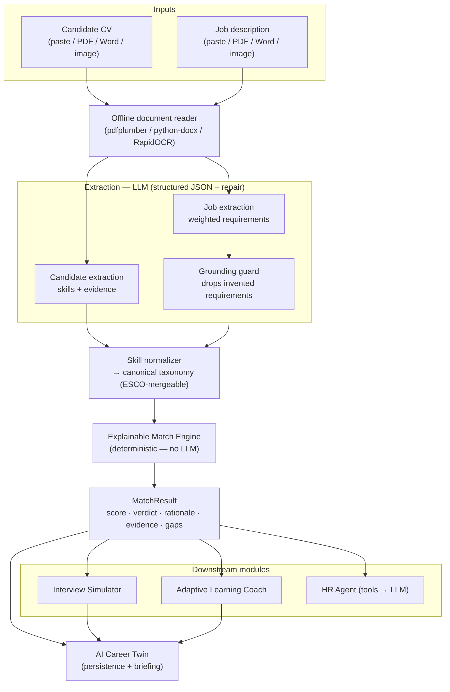

<h1 align="center">SkillBridge AI</h1>

<p align="center"><em>The distance between a résumé and a role — measured, explained, and closed.</em></p>

<p align="center">
An explainable, skill-based AI copilot that connects <b>education to employment</b>.
It reads a CV and a job description, extracts evidence-backed skills, scores the fit
with full transparency, and turns every gap into a plan — across matching, learning,
interview practice, recruiting, and a living career profile.
</p>

---

## Table of contents

- [Why SkillBridge](#why-skillbridge)
- [Features](#features)
- [How it works](#how-it-works)
- [Tech stack](#tech-stack)
- [Getting started](#getting-started)
- [Choosing your AI provider](#choosing-your-ai-provider)
- [Using the app](#using-the-app)
- [API reference](#api-reference)
- [Project structure](#project-structure)
- [Prompt engineering](#prompt-engineering)
- [Responsible AI](#responsible-ai)
- [Testing](#testing)

---

## Why SkillBridge

Education and recruitment are disconnected. Learners finish courses without knowing if
they're ready for real jobs. Recruiters screen CVs by keyword and miss strong,
non-traditional candidates. Hiring decisions rest on weak, unexplained evidence, and
interview prep is rarely realistic or role-specific.

**SkillBridge fixes the seam between learning and hiring.** A CV and a job description
become a structured **skill graph**; the fit is scored **transparently** — every match
cites the exact line that proves it — and the gaps become concrete action: a learning
roadmap, a mock interview, a recruiter brief, and a profile that grows with you.

It's built for everyone on both sides of that gap:

| User | What they get |
|------|----------------|
| **Learners** | A clear, evidence-backed map of missing skills and a sequenced plan to close them. |
| **Recruiters** | Explainable, skills-based screening with the evidence behind every match. |
| **Hiring managers** | A tool-grounded recruiter brief and role-specific interview questions. |
| **Educators** | Visibility into skill gaps and learning paths on a shared evidence base. |

---

## Features

### 🎯 Explainable skill matching

The heart of the system. Both the CV and the job are normalized onto a **canonical skill
taxonomy**, so a candidate's "ReactJS" and a job's "React.js" compare on the same skill —
not on noisy keyword overlap. The match score is a **transparent weighted average**, and
every requirement carries:

- a **status** — matched, partial, or missing,
- a **rationale** in plain language, and
- the candidate's **supporting evidence** quoted from their CV.

It's also **fair by design**: adjacent skills (related in the taxonomy) earn *partial*
credit, and "at least one of A / B / C" requirements are satisfiable by **any one** —
so a candidate isn't penalized three times for a choice they actually meet. This is what
surfaces strong, non-traditional candidates that keyword screens drop.

### 🧠 Evidence-backed skill extraction

A capable LLM reads the CV and extracts skills **with the evidence behind each one** —
preferring concrete, metric-bearing achievements ("Deployed a local LLM via Flask, cutting
drafting time 70%") over a generic skills list. It **infers implied skills** too
("mentored juniors / led ceremonies" → Leadership, Teamwork, Agile), and handles
**non-English CVs** (e.g. French) cleanly. A deterministic **anti-hallucination grounding
guard** then drops any job requirement that the model invented but the posting never
mentions.

### 📄 Offline document intake (no API key)

Drop in a **PDF, Word document, or an image / photo of a résumé**. Digital PDFs and Word
files are read with `pdfplumber` / `python-docx`; scanned PDFs and images go through
**RapidOCR** (PaddleOCR-grade models) with a noise-resistance preprocessing pass. **All
file reading happens locally with no API key** — your CVs never leave the machine for
parsing. The extracted text lands in an editable box so you can verify it before matching.

### 📚 Adaptive Learning Coach

Turns the match gaps into a **sequenced, personalized roadmap**. It prioritizes skills by
prerequisites, **leverages your existing strengths** to accelerate new ones, and for each
skill gives concepts, ordered steps, a **portfolio-building practice project**, real
resource links (a curated catalog of official docs + reputable free courses, merged with
the model's suggestions), and an estimated time. It closes with **week-by-week missions**,
each ending in a tangible deliverable.

### 🎤 Interview Simulator

A **role-specific mock interview** seeded from your real strengths and the job's gaps —
technical questions that probe your stated strengths, a behavioral question, a *gap*
question that assesses how you'd ramp up, and a motivation question. You answer them one
at a time, then get a **rubric-scored debrief**: a calibrated 0–5 grade per answer with
specific feedback, "what a strong answer covers," plus strengths, areas to work on, and
next steps. The overall score is **computed from the per-answer grades**, so it can't
drift from them.

### 🧰 HR Agent with tools

A **tool-using agent** that gathers live market evidence — a **salary benchmark** (by role
and seniority), **skill-demand** signals, a **market outlook**, and **fair-hiring
guidelines** — then reasons over it into an **advisory recruiter brief**: a recommendation
(advance / interview-with-focus / hold / not-yet), the rationale, interview focus areas,
risks, and responsible-hiring notes. Every tool call and its source is shown for full
transparency, and it stays explicitly **decision support** — a human makes the final call.

### ♻️ AI Career Twin

The flagship extension: a **persistent, living profile**. Save a match to your Twin and it
accumulates your activity — matches across roles, interview practice, learning plans —
into one evolving picture with aggregate stats, **recurring-gap detection across roles**,
an activity timeline, and an **AI briefing** on your momentum, the direction you're
strongest positioned for, and your next missions. Generating a plan or finishing an
interview **auto-logs to your Twin**, tying the whole loop together: *learn → practice →
prove → interview → match* on one trusted evidence base. It persists across sessions.

### 🔌 Provider-agnostic AI

The entire app talks to the model through one interface, so you can run it on **NVIDIA NIM
(Llama 3.1)**, **Google Gemini**, or a **local Ollama** model — switchable with a single
environment variable, **no code changes**. Develop on free cloud credits today; flip to a
fully local, private, unlimited model whenever you want.

### 🎨 Editorial, professional UI

A deliberately distinctive React interface — a warm, print-inspired "editorial" design
with a serif display typeface, a single confident accent, hairline structure, and numbered
sections. Polished score gauges, gradient-free clarity, file-upload cards, and rich result
views. It reads like a serious product, not a demo.

### 🛡️ Engineered like a product

- **Robust structured output** — explicit JSON schemas + a repair pass make extraction
  reliable across every provider.
- **Determinism where it matters** — scores, evidence, the grounding guard, and tool
  results are computed in code, so they're explainable and reproducible.
- **Clean error handling** — provider timeouts and rate limits surface as readable
  messages, never raw crashes.
- **~45 automated tests** plus an extraction-recall evaluation harness.

---

## How it works

One shared pipeline: documents become a structured skill graph, the match is computed
deterministically, and every module reuses the same trusted evidence base.



**The LLM understands language; the scoring and the evidence are computed in code.** That
split is what makes every recommendation explainable and reproducible.

---

## Tech stack

| Layer | Technology |
|-------|-----------|
| Backend | **FastAPI** (Python 3.11+), Pydantic, SQLAlchemy (SQLite) |
| Frontend | **React + TypeScript + Vite**, an editorial design system |
| LLM orchestration | **LangChain**, provider-agnostic (NVIDIA NIM · Gemini · Ollama) |
| Skills | Canonical taxonomy (curated seed, **ESCO**-mergeable), RapidFuzz normalization |
| Documents | pdfplumber, python-docx, **RapidOCR** (ONNX), PyMuPDF |
| Market data | Bundled salary / skill-demand datasets (live-API upgrade path) |
| Tests | pytest (~45 tests), extraction-recall harness |

---

## Getting started

### Backend

```bash
cd backend
python -m venv .venv && .venv\Scripts\activate     # macOS/Linux: source .venv/bin/activate
pip install -r requirements.txt
cp .env.example .env                                # then set your provider (below)
uvicorn app.main:app --reload                       # API + docs at http://localhost:8000/docs
```

### Frontend

```bash
cd frontend
npm install
npm run dev                                          # http://localhost:5173 (proxies /api -> :8000)
```

Open **http://localhost:5173**, paste or upload a CV and a job description, and click
**Run explainable match**.

---

## Choosing your AI provider

Set these in `backend/.env`. Switching providers is a one-line change.

**Google Gemini** (generous free tier, 1M-token context)

```ini
LLM_PROVIDER=openai_compatible
OPENAI_BASE_URL=https://generativelanguage.googleapis.com/v1beta/openai/
OPENAI_API_KEY=your-gemini-key            # free at https://aistudio.google.com/apikey
OPENAI_CHAT_MODEL=gemini-2.5-flash        # or gemini-2.5-flash-lite for higher free limits
```

**NVIDIA NIM** (free dev credits, Llama 3.1)

```ini
LLM_PROVIDER=nvidia
NVIDIA_API_KEY=nvapi-...                   # free at https://build.nvidia.com
NVIDIA_CHAT_MODEL=meta/llama-3.1-8b-instruct
```

**Local Ollama** (free, unlimited, fully private)

```ini
LLM_PROVIDER=openai_compatible
OPENAI_BASE_URL=http://localhost:11434/v1
OPENAI_API_KEY=ollama
OPENAI_CHAT_MODEL=llama3.1:8b              # after: ollama pull llama3.1:8b
```

---

## Using the app

1. **Match** — paste/upload a CV + job description → *Run explainable match*. Get the score,
   verdict, per-skill evidence, gaps, and extra strengths.
2. **Save to Career Twin** — turn the assessment into a persistent living profile.
3. **Generate learning plan** — gaps become a sequenced roadmap with practice projects.
4. **Interview practice** — a tailored mock interview with a scored debrief.
5. **Recruiter view** — a tool-grounded, advisory hiring brief.
6. **Career Twin** — watch your profile grow across roles, with an AI briefing and timeline.

---

## API reference

Interactive docs at `/docs`.

| Method | Path | Purpose |
|-------:|------|---------|
| GET  | `/health` | Status, active provider/model, taxonomy size |
| POST | `/documents/extract-text` | Read a PDF / Word / image into text (offline OCR) |
| POST | `/match/adhoc` | One-shot explainable match from CV + job text |
| POST | `/match` · `/candidates/text` · `/jobs/text` | Persisted match against stored candidate/job |
| POST | `/learning-plan` | Turn match gaps into a sequenced learning plan |
| POST | `/interview/start` · `/interview/report` | Mock-interview questions → scored debrief |
| POST | `/hr/recommendation` | Tool-grounded, advisory recruiter brief |
| POST | `/twin/save` · GET `/twin/{id}` | Save activity to / read the Career Twin |

---

## Project structure

```
SkillBridge AI/
├── backend/
│   ├── app/
│   │   ├── core/         config, logging, provider-agnostic LLM factory
│   │   ├── db/           SQLAlchemy models + session
│   │   ├── schemas/      Pydantic: extraction, match, learning, interview, hr, twin
│   │   ├── services/
│   │   │   ├── taxonomy/   canonical skill store + normalizer
│   │   │   ├── extraction/ document parsing + LLM extraction + grounding
│   │   │   ├── matching/   explainable match engine (deterministic)
│   │   │   ├── learning/   adaptive learning coach + resource catalog
│   │   │   ├── interview/  interview simulator (questions + grading)
│   │   │   ├── hr/         tool-using HR agent + market datasets
│   │   │   └── twin/       Career Twin persistence + briefing
│   │   ├── api/routes/   health, documents, matching, learning, interview, hr, twin
│   │   └── main.py
│   ├── tests/            ~45 offline tests (no API key needed)
│   └── requirements.txt
├── frontend/             React + Vite + TypeScript (editorial UI)
├── data/                 skill taxonomy, learning resources, market datasets
├── scripts/              ESCO ingestion, extraction-recall evaluation
└── docs/                 project brief · workflow · prompt library · structured outputs
```

---

## Prompt engineering

Seven production prompts power the reasoning, each pairing a **system** prompt (role +
rules) with a **template** (data + an explicit JSON shape): candidate extraction, job
extraction, the learning coach, interview question generation, interview grading, the HR
brief, and the Career-Twin briefing. Cross-cutting techniques:

- **Explicit JSON shapes** in the template (not just function calling) so the prompts work
  identically across NVIDIA NIM, Gemini, and local Ollama.
- **Robust parsing** — strip fences → extract the JSON object → validate against a Pydantic
  schema → one repair retry on failure.
- **Calibration** — intern/junior-aware requirement importance, an "at least one of"
  alternatives mechanism, and an anti-inflation interview rubric.
- **Low/zero temperature** for faithful, reproducible structure.

See `docs/03-prompt-library.md` for the full library, and `docs/02-workflow.md` for the
annotated pipeline.

---

## Responsible AI

Built in from the start, because this touches education and recruitment:

- **Fairness** — matching compares on **skills and evidence only**, never school, age,
  gender, or nationality, and rewards adjacent skills so non-traditional paths aren't
  penalized. Fair-hiring guidelines are injected into the recruiter brief.
- **Human-in-the-loop** — the HR Agent is explicitly *decision support*, with a disclaimer
  that a human decides; uploaded text is shown for verification before use.
- **Privacy** — document reading is fully offline with no API key, and a local-Ollama
  provider keeps all data on-device. Secrets live only in a gitignored `.env`.
- **Transparency** — every recommendation shows its evidence, and the HR Agent exposes the
  exact tools and data it used.

---

## Testing

```bash
cd backend
.venv\Scripts\python.exe -m pytest          # ~45 deterministic tests, no API key needed
python scripts/eval_extraction.py           # live extraction-recall evaluation (needs a provider)
```

The core engine — normalization, scoring, explainability, grounding, and every module's
service and endpoint — is covered offline with the LLM mocked, so the suite is fast and
reproducible.
