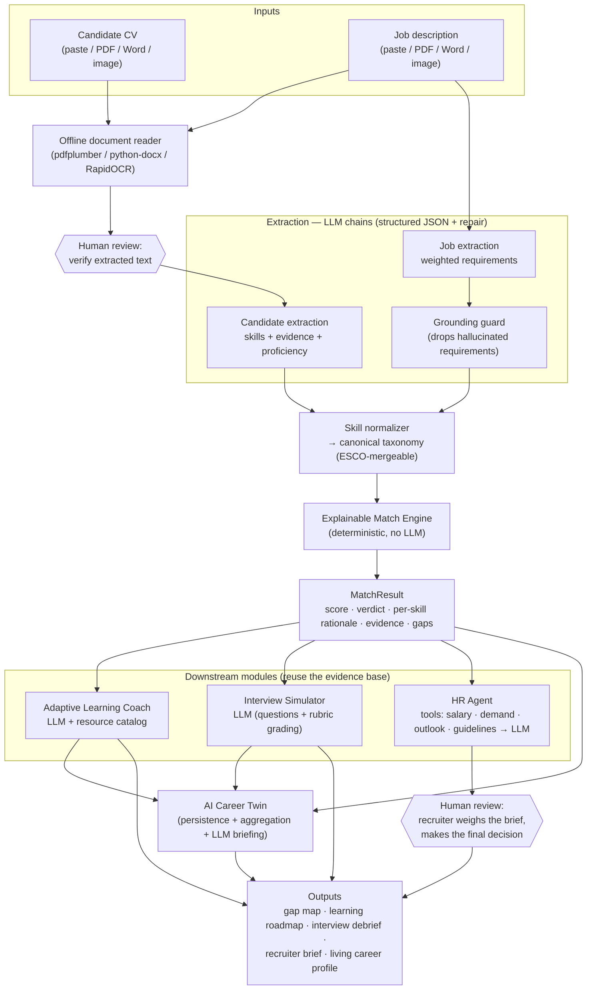

# SkillBridge AI — Workflow

The system is one shared pipeline: documents → structured skills → an explainable
match → downstream modules that all reuse the same trusted evidence base. LLM steps,
deterministic steps, external tools, and **human-review points** are marked below.

## Where the LLM is used vs. where it isn't

- **LLM (reasoning):** candidate/job extraction, learning-plan generation, interview
  question generation + grading, HR brief synthesis, Career-Twin briefing.
- **Deterministic (reproducible):** skill normalization, the match engine and its score,
  the grounding guard, the salary/demand/outlook tools, the interview overall score
  (computed from per-answer grades), Career-Twin aggregation.

This split is deliberate: the LLM handles language understanding; the **scoring and the
evidence are deterministic**, so results are explainable and reproducible.

## Human-review points (decision support, not automation)

1. **Extracted-text verification** — uploaded documents land in an editable box; the
   user confirms before matching.
2. **Final hiring decision** — the HR Agent's brief is explicitly advisory, with a
   human-in-the-loop disclaimer and fair-hiring guidelines; a recruiter decides.
